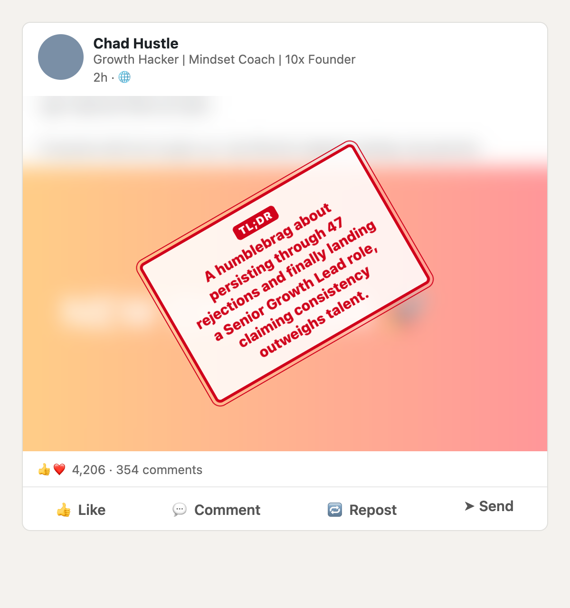

# LinkedIn TL;DR

A Chrome extension that blurs long LinkedIn posts and stamps a one-sentence summary on top of them while you scroll.

- Blurs the post text and the photo or video under it.
- Summarizes posts before they reach your screen, so the stamp is usually there when you arrive.
- Calls out engagement bait and humblebrags.
- Click the post to read the original, click the TL;DR chip to blur it again.

## Install

The extension isn't on the Chrome Web Store yet. Load it from source:

1. Clone this repo, or download it as a ZIP and unzip it.
2. Open `chrome://extensions` and turn on **Developer mode**.
3. Click **Load unpacked** and pick the repo folder.
4. The settings page opens. Paste a Vercel AI Gateway API key and click **Save**.
5. Open or refresh LinkedIn.

Works in Chrome and Chromium-based browsers (Arc, Brave, Edge, Helium). There's no build step.

## API key

Summaries come from [Vercel AI Gateway](https://vercel.com/ai-gateway). Create a key in the Vercel dashboard under **AI Gateway → API Keys**. The key stays in your browser's extension storage and goes only to `ai-gateway.vercel.sh`.

The default model is `openai/gpt-oss-120b`, routed to Cerebras first and Groq second. A summary takes about a second and costs a tiny fraction of a cent: at $0.10 per million input tokens and $0.50 per million output tokens, a long post costs roughly $0.0001.

## Settings

Click the extension icon to open the settings.

| Setting | Default | |
|---|---|---|
| Model | `gpt-oss-120b` (Cerebras → Groq) | `gpt-oss-20b` on Groq is cheaper; `gemini-2.5-flash-lite` is also available |
| Summary language | Your browser's language | Any language name, e.g. `Turkish`, `German` |
| Minimum length | 280 characters | Posts LinkedIn cuts off with "…more" are summarized from 80 characters |
| Enabled | On | Turn off to restore the normal feed |

## How it works

- `content.js` finds post text on linkedin.com and asks for a summary when a post comes within 1500px of the screen.
- `background.js` calls AI Gateway's OpenAI-compatible chat completions endpoint. Summaries are cached for the browser session, so scrolling back costs nothing.
- The blur is a `backdrop-filter` layer placed over the post text and media. That keeps it working when LinkedIn changes its markup. The stamp lives in a shadow root so LinkedIn's CSS can't restyle it.

## Privacy

The extension sends the text of long posts in your feed to Vercel AI Gateway, which forwards it to the model provider. It sends nothing else and collects no analytics.

## When LinkedIn changes its markup

LinkedIn changes its feed markup often. If stamps stop appearing, the selectors in `POST_TEXT_SELECTOR` at the top of `content.js` probably need updating. Issues and PRs are welcome.

## License

[MIT](LICENSE)
